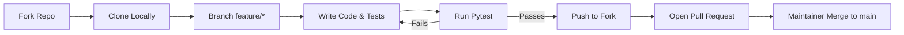

# dev-utility-lab

[](https://www.python.org/downloads/)
[](https://github.com/Jags-08/dev-utility-lab/actions)
[](https://opensource.org/licenses/MIT)
[](https://docs.pytest.org)
[](https://coveralls.io/github/Jags-08/dev-utility-lab?branch=main)
[](https://mypy-lang.org/)
[](https://github.com/astral-sh/ruff)

A growing collection of clean, reusable Python utility functions for everyday development tasks.

## Features

- **Math Utilities**: Arithmetic, factorial, Fibonacci sequences, prime checking, GCD, and LCM.
- **String Manipulation**: Reversing strings and checking palindromes.
- **Randomization**: Random integers, choices, and list shuffling.
- **File & Data Operations**: Reading files safely and parsing JSON documents.
- **Security Utilities**: Generating random passwords.

## Example Usage

Here are examples of how to use our utilities with the new modular package layout:

```python
from dev_utils.math_ops import add, is_prime
from dev_utils.data_ops import read_json
from dev_utils.random_ops import generate_password

# Math operations
print(add(5, 3))           # Output: 8
print(is_prime(11))        # Output: True

# Data operations
data = read_json('config.json')
print(data)

# Security operations
pwd = generate_password(16)
print(f"Generated secure password: {pwd}")
```

## Why This Project Exists

Open source tooling is frequently cluttered and overly complex. `dev-utility-lab` was created to serve as a lightweight, clean, and easily auditable standard library of operations we perform every day across Python applications.

## Getting Started / Quick Start

Read our exhaustive [Getting Started Guide](docs/getting-started.md) to bootstrap your application immediately!

Since `dev-utility-lab` is structured as a proper Python package, you can install it directly into your environment using `pip`!

1. Clone the repository to your local machine:
   ```bash
   git clone https://github.com/Jags-08/dev-utility-lab.git
   cd dev-utility-lab
   ```
2. Install the package in editable mode (this installs the CLI tool as well!):
   ```bash
   pip install -e .
   ```
3. Import from the `dev_utils` package into your Python projects, or use the `dev-utils` CLI.

## Screenshots & CLI Showcase

Check out the [Detailed CLI Examples](docs/cli-examples.md) to see `dev-utils` perfectly interact with shell piping!

## Developer Dashboard UI 🌐

`dev-utility-lab` includes a lightweight, clean, dark-mode inspired local web dashboard built with Flask. This dashboard showcases project metrics, CLI examples, live benchmarks, and system configurations.

To run the dashboard:

1. Install the dashboard dependencies:
   ```bash
   pip install -e ".[dashboard]"
   ```
2. Start the local server:
   ```bash
   cd dashboard
   flask --app app run
   ```
3. Open your browser and navigate to `http://127.0.0.1:5000`.

*Features include:* Live operation benchmarks (`/benchmarks`), system module visualization, and fully responsive layouts mapping directly directly to `benchmark_core.py`.

## Command-Line Interface (CLI)

`dev-utility-lab` provides a built-in terminal app for executing operations directly from your shell.

```bash
# Add two numbers together
dev-utils add 5 7
# Output: 12

# Calculate factorial
dev-utils factorial 5
# Output: 120

# Reverse a string
dev-utils reverse-string hello
# Output: olleh

# Generate a random 16-character password
devRelease Notes & Plans

**Current Version:** v0.1.0  
See our [CHANGELOG.md](CHANGELOG.md) for a detailed history of updates.

**Future Planned Features**
Check our [ROADMAP.md](ROADMAP.md) to see what we're building next! Priorities include:
* Persistent configuration files for the CLI
* File recursion tooling and improved standard logging wrappers
* Pre-compiled standalone binaries!

## -utils generate-password --length 16
```

Use `dev-utils --help` to see all available commands!

## Project Architecture Overview

Below is the conceptual architecture of how packages interact within the source.

```ascii
                      +-------------------+
                      |   CLI Entrypoint  |
                      |  (dev_utils/cli)  |
                      +---------+---------+
                                |
          +---------------------+---------------------+
          |                     |                     |
 +--------v--------+   +--------v--------+   +--------v--------+
 |   math_ops.py   |   |   string_ops.py |   |  random_ops.py  |
 | (Factorial, GCD)|   |  (Palindromes)  |   | (Password Gen)  |
 +-----------------+   +-----------------+   +-----------------+
          |                     |                     |
          +---------------------+---------------------+
                                |
                      +---------v---------+
                      |   Core Package    |
                      |   (__init__.py)   |
                      +-------------------+
```

```
dev_utils/
├── __init__.py     # Exposes all utilities
├── math_ops.py     # add, factorial, is_prime, fibonacci, gcd, lcm, etc.
├── string_ops.py   # reverse_string, is_palindrome
├── random_ops.py   # random_int, random_choice, shuffle_list, generate_password
└── data_ops.py     # read_file, read_json
```

## Testing and CI

This repository uses **pytest** for automated testing and **GitHub Actions** for Continuous Integration (CI). 

Every time code is pushed or a Pull Request is opened against the `main` branch, GitHub Actions will automatically provision an Ubuntu server, install the dependencies, and run the entire test suite. This ensures that we maintain a highly reliable and heavily tested utility library without any manual validation required on PRs!

To run tests locally:
```bash
pip install -r requirements-dev.txt
pip install -e .
pytest tests/
```

## Contributing Workflow

Here's how we build features securely together:



Read the full [CONTRIBUTING.md](CONTRIBUTING.md) for code of conduct and best practices.

