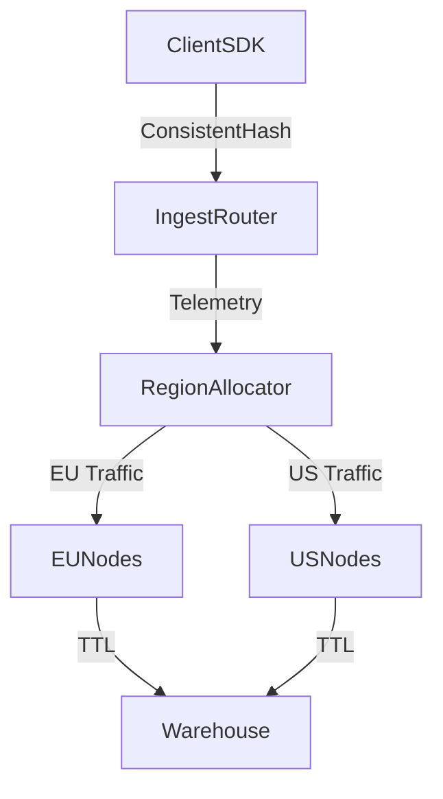

# Telemetry Federation Architecture

```mermaid
graph TD;
    ClientSDK-->|ConsistentHash|IngestRouter;
    IngestRouter-->|Telemetry|RegionAllocator;
    RegionAllocator-->|EU Traffic|EUNodes;
    RegionAllocator-->|US Traffic|USNodes;
    EUNodes-->|TTL|Warehouse;
    USNodes-->|TTL|Warehouse;
```
